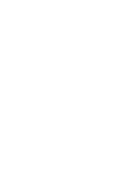
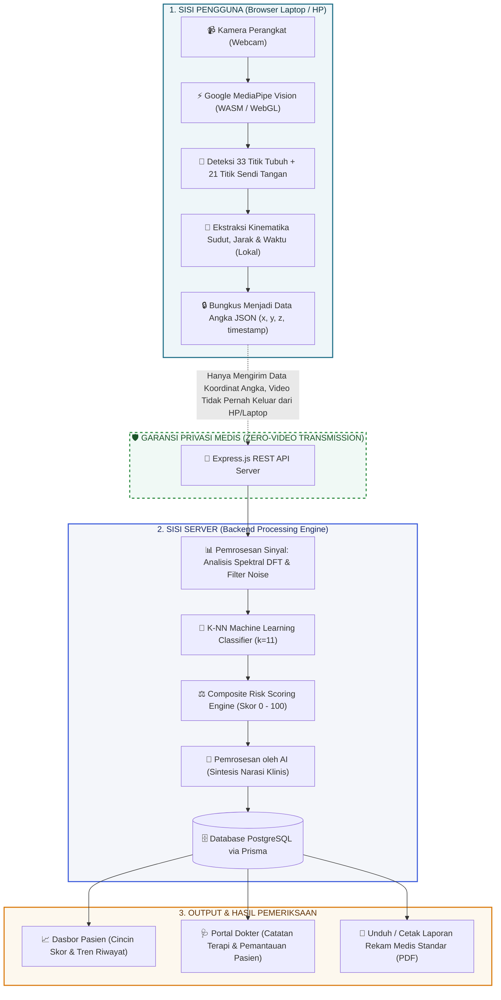
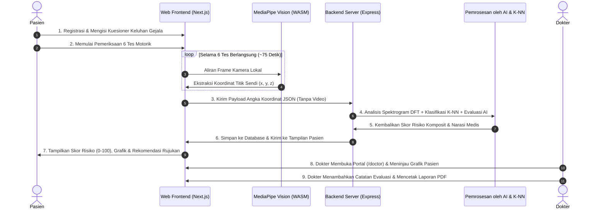
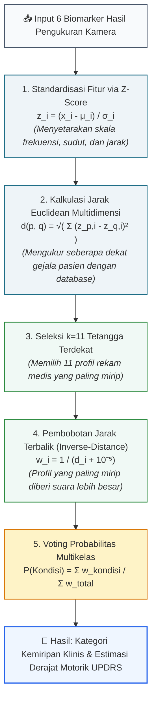
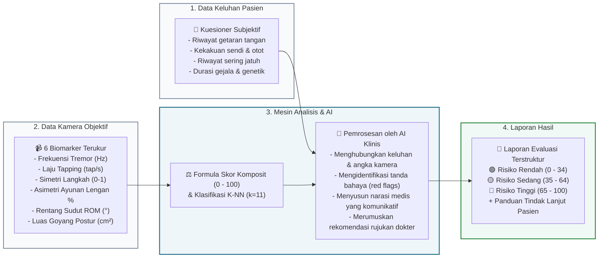

# 🧠 NeuronMotion  -  Sistem Skrining Gangguan Neurologis Berbasis Computer Vision & AI

<p align="center">
  
</p>

<p align="center">
  <strong>Skrining Motorik Neurologis Non-Invasif Berbasis Web Kamera (Webcam/HP) Pertama dengan Privasi Mutlak (Zero-Video Transmission).</strong>
</p>

<p align="center">
  
  
  
  
  
</p>

---

## 💡 Apa Itu NeuronMotion? (Penjelasan Ringkas dalam 30 Detik)

Banyak penyakit gangguan saraf motorik seperti **Penyakit Parkinson**, **Pasca Stroke**, dan **Ataksia** terlambat ditangani karena gejalanya muncul perlahan dan akses ke dokter spesialis saraf (neurolog) serta laboratorium gerak (*gait lab*) sangat terbatas dan mahal.

**NeuronMotion hadir sebagai solusinya:**
Cukup dengan membuka website lewat laptop atau *smartphone* yang memiliki kamera (webcam), pasien dapat melakukan **6 tes gerakan motorik mandiri selama ~75 detik**. Sistem secara otomatis membaca getaran halus (*tremor*), kecepatan ketukan jari, simetri pola jalan, ayunan lengan, kelenturan sendi, dan keseimbangan tubuh untuk menghitung **Skor Risiko Neurologis (0-100)** dan memberikan rekomendasi rujukan medis secara instan.

> 🔒 **Keamanan Privasi 100%**: Video kamera Anda **TIDAK PERNAH dikirim atau disimpan di server internet**. Seluruh pemrosesan video dilakukan langsung di dalam browser Anda (*client-side*). Server hanya menerima angka koordinat sendi murni.

---

## 👥 1. Susunan Tim Pengembang

**Nama Tim:** Last Dance

| No | Foto / Nama | Peran & Tanggung Jawab Utama |
|:---:|:---|:---|
| 1 | **Siti Aminatuzzuhriyah** | **Project Lead & Clinical Researcher**<br>• Riset kriteria klinis skala MDS-UPDRS.<br>• Validasi rentang patologis 6 biomarker neurologi.<br>• Pemodelan distribusi dataset klinis. |
| 2 | **Adhitya Hermawan** | **Machine Learning & Backend Engineer**<br>• Pengembangan algoritma pemrosesan sinyal (DFT & PCA).<br>• Arsitektur classifier K-NN ($k=11$) dan standardisasi Z-Score.<br>• Pengembangan RESTful API & manajemen basis data PostgreSQL/Prisma. |
| 3 | **Muhammad Akhza Fachrozy** | **Frontend/Vision Architect & Deployment**<br>• Perancangan arsitektur sistem *end-to-end*.<br>• Integrasi Google MediaPipe Vision (WASM/WebGL) di browser.<br>• Desain antarmuka responsif (*Design System*) & integrasi AI. |

---

## 🛠️ 2. Tech Stack & Teknologi yang Digunakan

```
┌─────────────────────────────────────────────────────────────────────────────┐
│                              TECH STACK OVERVIEW                            │
├──────────────────────┬──────────────────────┬───────────────────────────────┤
│  Frontend & Vision   │  Backend & Database  │      AI & Pemrosesan Sinyal   │
├──────────────────────┼──────────────────────┼───────────────────────────────┤
│ • Next.js 16 (App)   │ • Node.js (ESM)      │ • Discrete Fourier Transform  │
│ • React 19           │ • Express.js REST API│ • Principal Component Analysis│
│ • TypeScript         │ • PostgreSQL         │ • K-Nearest Neighbors (k=11)  │
│ • Vanilla CSS Tokens │ • Prisma ORM         │ • Z-Score Standardization     │
│ • MediaPipe Vision   │ • JWT Authentication │ • Pemrosesan oleh AI Medis    │
│   (WASM & WebGL GPU) │ • Bcrypt Security    │ • Moving-Average & Peak Detect│
└──────────────────────┴──────────────────────┴───────────────────────────────┘
```

---

## 🏛️ 3. Arsitektur Sistem

Sistem ini memisahkan secara tegas antara **pemrosesan video lokal di sisi klien** dan **analisis data di sisi server**:



---

## 📹 4. Rincian 6 Tes Biomarker Motorik Kamera

Semua tes dirancang agar mudah dilakukan sendiri di rumah tanpa bantuan orang lain:

| No | Nama Tes | Durasi | Gerakan yang Dilakukan | Apa yang Dideteksi & Dihitung Sistem? |
|:---:|:---|:---:|:---|:---|
| **1** | **Rest Tremor** | 15 detik | Menaruh tangan rileks di depan kamera saat diam. | Menganalisis getaran frekuensi mikro (Hz) dan amplitudo pergeseran (mm) via Fourier Transform (DFT). |
| **2** | **Finger Tapping** | 10 detik | Mengetuk ibu jari dan telunjuk secepat dan selebar mungkin. | Menghitung laju ketukan (*tap/detik*) dan penurunan ritme/amplitudo (*fatigue/decrement*) tanda bradikinesia. |
| **3** | **Pola Jalan (Gait)** | 20 detik | Berjalan bolak-balik secara alami di area pandang kamera. | Melacak trajektori pergelangan kaki untuk menghitung irama langkah (*cadence*) dan indeks simetri langkah kiri vs kanan. |
| **4** | **Ayunan Lengan** | 10 detik | Mengamati ayunan tangan saat melangkah. | Menghitung rasio asimetri ayunan lengan kiri vs kanan (penurunan ayunan satu sisi adalah tanda awal Parkinson). |
| **5** | **Rentang Gerak (ROM)** | 10 detik | Menggerakkan sendi siku, bahu, atau lutut secara maksimal. | Menghitung derajat fleksibilitas sudut sendi (°) yang disesuaikan dengan usia pasien (*age-adjusted*). |
| **6** | **Keseimbangan (Romberg)** | 10 detik | Berdiri tegak dengan kaki rapat dan tangan di samping. | Mengukur luas area goyangan tubuh (*Center of Mass Sway Area*) dan panjang lintasan goyangan. |

---

## 🔄 5. Alur Kerja Sistem Lengkap (*End-to-End*)



---

## 🧮 6. Cara Kerja Algoritma K-Nearest Neighbors (K-NN)

### **Analogi Sederhana K-NN:**
> *Bayangkan seorang dokter berpengalaman yang memiliki buku rekam medis berisi ribuan profil pasien terdahulu. Ketika ada pasien baru datang dengan 6 hasil pengukuran gerakan, dokter akan **mencari 11 pasien terdahulu yang kondisinya paling mirip ($k=11$)**. Jika mayoritas pasien yang mirip tersebut didiagnosis mengalami Parkinson tahap awal, maka pasien baru tersebut diklasifikasikan memiliki pola yang condong ke Parkinson tahap awal.*



### **Spektrum 6 Kondisi yang Dideteksi:**
1. **`HEALTHY`**: Kontrol Sehat / Getaran fisiologis normal manusia.
2. **`PARKINSON_EARLY`**: Parkinson Tahap Awal (Skala Hoehn-Yahr 1-2).
3. **`PARKINSON_ADVANCED`**: Parkinson Lanjut dengan gangguan keseimbangan bilateral (Hoehn-Yahr 3-4).
4. **`ESSENTIAL_TREMOR`**: Tremor Aksi Bilateral (sering disalahartikan sebagai Parkinson, namun pola ayunan dan langkahnya tetap normal).
5. **`POST_STROKE`**: Defisit Motorik / Kelemahan satu sisi tubuh (*Hemiparesis*) pasca stroke.
6. **`CEREBELLAR_ATAXIA`**: Ataksia Serebelar (gangguan koordinasi motorik dan ketidakseimbangan tubuh yang menonjol).

---

## 🧠 7. Proses Analisis Sistem & Pemrosesan oleh AI

Sistem menggabungkan **kalkulasi deterministik angka** dengan **pemrosesan oleh AI**:



### **Rumus Pembobotan Skor Risiko Komposit:**
$$\text{Skor Risiko} = \frac{0.25(\text{Tremor}) + 0.25(\text{Tapping}) + 0.20(\text{Gait}) + 0.12(\text{Ayunan}) + 0.12(\text{Postur}) + 0.06(\text{ROM})}{\sum \text{Bobot Aktif}}$$

- 🟢 **Skor 0 - 34 (Risiko Rendah)**: Pola motorik normal, disarankan skrining berkala tiap 6 bulan.
- 🟡 **Skor 35 - 64 (Risiko Sedang)**: Terdapat anomali gerak ringan/sedang, disarankan latihan fisioterapi mandiri dan evaluasi ulang dalam 2 minggu.
- 🔴 **Skor 65 - 100 (Risiko Tinggi)**: Terdapat tanda defisit motorik signifikan, sistem menyarankan pasien segera berkonsultasi ke dokter spesialis saraf.

---

## 📖 8. Riwayat, Alasan Medis & Pembentukan Dataset Klinis

Bagian ini menceritakan latar belakang ilmiah mengapa dataset NeuronMotion dibangun seperti saat ini:

### **A. Mengapa Akurasi 100% di Awal Ditolak? (Realitas Medis)**
Pada awal perancangan, model diuji dengan dataset sintetis yang memiliki batas-batas angka terpisah kaku antar penyakit. Model dengan mudah meraih akurasi 100%. Namun, tim segera menyadari bahwa **angka 100% tersebut tidak realistis dan berbahaya di dunia medis nyata**:
1. **Tremor Fisiologis Normal Ada pada Setiap Orang**: Orang sehat tetap memiliki getaran tangan alami berfrekuensi $6 - 12\text{ Hz}$ dengan amplitudo sangat halus ($< 5\text{ mm}$). Yang membedakannya dari tremor patologis adalah **amplitudo simpangan**, bukan ketiadaan getaran sama sekali.
2. **Irisan Gejala (*Overlapping Spectrum*)**: Frekuensi *Essential Tremor* ($4 - 12\text{ Hz}$) secara alami beririsan dengan *Parkinson* ($3 - 7\text{ Hz}$). Membedakan keduanya adalah salah satu tantangan diagnostik tersulit di dunia neurologi.
3. **Pengaruh Penuaan Alami**: Lansia yang sehat secara alami mengalami sedikit penurunan kecepatan jalan dan kelenturan sendi (*age-related baseline drift*), sehingga terdapat wilayah abu-abu (*gray area*) dengan pasien Parkinson tahap awal.

Oleh karena itu, dataset referensi **sengaja direvisi agar saling beririsan mengikuti realitas klinis yang sesungguhnya**.

### **B. Koreksi Medis Penting: Mitos Kecepatan Langkah (*Cadence*) Parkinson**
Pada asumsi awal, pasien Parkinson dianggap berjalan jauh lebih lambat (jumlah langkah per menit rendah). Namun setelah merujuk pada meta-analisis jurnal kedokteran terkini (*Zanardi et al., 2021, Scientific Reports*):
- Pasien Parkinson justru memiliki *cadence* yang **setara atau bahkan sedikit lebih cepat (+1.75 langkah/menit)** dibanding orang sehat.
- Yang sebenarnya memburuk pada Parkinson adalah **panjang langkah (*stride length*)** dan **simetri langkah**, akibat fenomena *festination* (langkah-langkah kecil pendek yang tergesa-gesa).
- Tim mengoreksi model dengan mengalihkan bobot pembeda ke **Indeks Simetri Langkah** dan **Asimetri Ayunan Lengan**, menghasilkan pemodelan yang jauh lebih sahih secara medis.

### **C. Cara Pembuatan Dataset Sintetis (Metodologi Ilmiah)**
1. **Distribusi Gaussian (Box-Muller Transform)**:
   Nilai setiap biomarker dibangkitkan mengikuti kurva lonceng normal di sekitar titik tengah rentang klinisnya dengan standar deviasi $\sigma = \frac{\text{max} - \text{min}}{4}$.
2. **Deterministik via Seeded PRNG (*mulberry32*)**:
   Dataset dibangun dengan generator bilangan acak berbasis kunci benih (*seed*) tetap agar hasil pelatihan selalu konsisten, tidak berubah-ubah tiap kali server di-restart (*reproducible*), dan transparan untuk diaudit.
3. **Simulasi Galat Kamera Dunia Nyata ($\pm 8\%$)**:
   Dari total 2.000 sampel data, sebanyak 1.600 data digunakan untuk melatih model (*training set*) dan 400 data untuk menguji model (*test set*). Pada 400 data uji, disuntikkan gangguan acak $\pm 8\%$ untuk menyimulasikan kamera HP bergoyang atau pencahayaan minim.

### **D. Rujukan Literatur Ilmiah:**
- **MDS-UPDRS Guidelines**: Goetz, C. G., et al. (2008). *Movement Disorder Society-sponsored revision of the Unified Parkinson's Disease Rating Scale*. Movement Disorders, 23(15), 2129-2170.
- **Klasifikasi Tremor & Amplitudo**: Scholarpedia *Tremor Classification*; Crawford, P. & Zimmerman, E. E. (2011). *Tremor: Sorting Through the Differential Diagnosis*. American Family Physician, 83(6), 697-702.
- **Diferensiasi Frekuensi Tremor**: Zhang, X., et al. (2017). *Distinguishing Parkinson's Disease and Essential Tremor via Frequency Spectrum Analysis*. Parkinson's Disease Journal.
- **Karakteristik Gait & Koreksi Cadence**: Zanardi, A. P. J., et al. (2021). *Gait parameters in Parkinson’s disease: A systematic review and meta-analysis*. Scientific Reports, 11, 11115.
- **Asimetri Ayunan Lengan**: Lewek, M. D., et al. (2010). *Arm swing asymmetry in early Parkinson’s disease: A sensitive marker of disease onset*. Gait & Posture, 31(4), 519-524.

---

## 📊 9. Hasil Sistem & Bukti Keakuratan (97.3%)

Akurasi divalidasi secara ilmiah menggunakan metode **Holdout Validation 80/20**:

| Parameter Pengujian | Nilai / Hasil Pengujian |
|:---|:---|
| **Total Dataset Referensi Klinis** | 2.000 Profil Klinis Sintetis Gaussian (MDS-UPDRS) |
| **Data Latih (*Training Set*)** | 1.600 Sampel (80%) |
| **Data Uji Mandiri (*Test Set*)** | 400 Sampel (20%) |
| **Simulasi Gangguan Kamera (*Noise Injection*)** | $\pm 8\%$ pada seluruh 400 data uji |
| **Prediksi Benar (*Correct Predictions*)** | **389 dari 400 data uji** |
| **Akurasi Validasi Akhir** | **97.3%** |

### **Tabel Parameter Nilai Biomarker Normal vs Gangguan Saraf:**

| Parameter Biomarker | Orang Sehat (Normal) | Parkinson Awal | Parkinson Lanjut | Essential Tremor |
|:---|:---:|:---:|:---:|:---:|
| **Frekuensi Tremor** | 6.0 - 12.0 Hz (Fisiologis) | **4.0 - 6.0 Hz (Khas)** | 4.0 - 6.0 Hz | 6.0 - 12.0 Hz |
| **Amplitudo Tremor** | $< 5\text{ mm}$ (Sangat Halus) | $6 - 24\text{ mm}$ | $> 25\text{ mm}$ | $10 - 40\text{ mm}$ |
| **Kecepatan Tapping** | $3.5 - 6.0\text{ ketukan/s}$ | $2.2 - 3.8\text{ ketukan/s}$ | $0.9 - 2.4\text{ ketukan/s}$ | $2.9 - 4.6\text{ ketukan/s}$ |
| **Penurunan Amplitudo Tapping** | $< 12\%$ | **$14 - 38\%$ (Kelelahan)** | $> 35\%$ | $< 16\%$ |
| **Simetri Langkah Jalan** | $0.90 - 0.99$ (Sangat Simetris) | $0.78 - 0.92$ | $0.60 - 0.80$ | $0.86 - 0.97$ |
| **Asimetri Ayunan Lengan** | $< 15\%$ (Seimbang) | **$15 - 35\%$ (Asimetris)** | $> 35\%$ | $< 22\%$ |
| **Luas Goyangan Berdiri** | $< 0.0035\text{ cm}^2$ (Kokoh) | $0.004 - 0.013\text{ cm}^2$ | $> 0.015\text{ cm}^2$ | $< 0.008\text{ cm}^2$ |

---

## 🚀 10. Panduan Menjalankan Aplikasi di Komputer Lokal

### **Prasyarat:**
- Komputer dengan OS Windows, macOS, atau Linux
- Node.js versi 20.x atau lebih baru ([Unduh Node.js](https://nodejs.org/))

### **Langkah Menjalankan:**
```bash
# 1. Clone repositori dari GitHub
git clone https://github.com/akhzaozy/neuronmotion.git
cd neuronmotion

# 2. Setup dependensi dan database (cukup 1 kali)
npm run setup

# 3. Jalankan server backend dan frontend secara bersamaan
npm run dev:all
```

Buka peramban (browser) dan akses alamat: **`http://localhost:3000`**

### **Akun Demo Siap Pakai:**
| Peran | Alamat Email | Kata Sandi | Kegunaan |
|:---|:---|:---|:---|
| **Pasien** | `pasien@neuronmotion.id` | `password123` | Mencoba skrining kamera, melihat skor risiko & riwayat sesi |
| **Dokter** | `dr.dewi@neuronmotion.id` | `doctor123` | Membuka portal dokter, melihat grafik pasien, menulis catatan terapi & cetak PDF |
| **Admin** | `admin@neuronmotion.id` | `admin123` | Akses API statistik sistem & akurasi model |

---

## 🙏 11. Ucapan Terima Kasih

Puji syukur kami panjatkan atas terselesaikannya pengembangan sistem **NeuronMotion**. Kami tim **Last Dance** menyampaikan rasa terima kasih dan apresiasi yang setinggi-tingginya kepada:

1. **Dosen Pembimbing & Mentor**, atas bimbingan, arahan metodologi ilmiah, serta masukan yang sangat berharga selama proses perancangan sistem ini.
2. **Seluruh Rekan Tim Last Dance** (*Siti Aminatuzzuhriyah, Adhitya Hermawan, dan Muhammad Akhza Fachrozy*), atas dedikasi, kolaborasi, dan kerja keras dalam mewujudkan inovasi teknologi kesehatan yang inklusif.
3. **Semua Pihak yang Telah Mendukung**, yang tidak dapat kami sebutkan satu per satu, yang telah memberikan dukungan moral maupun teknis.

Semoga **NeuronMotion** dapat memberikan kontribusi nyata dalam memperluas akses deteksi dini dan pemantauan gangguan saraf bagi masyarakat luas! 🚀🎯
